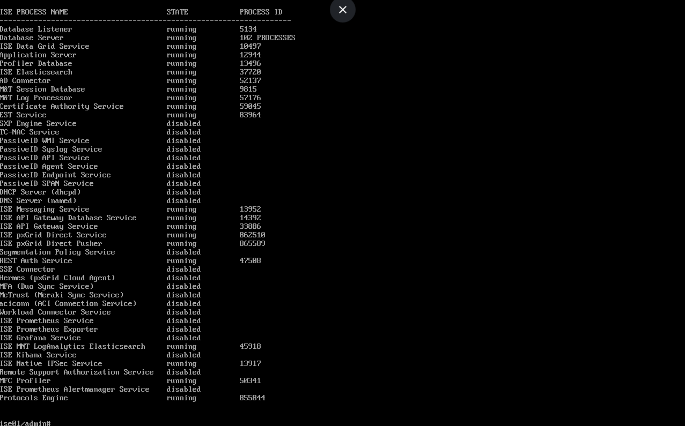
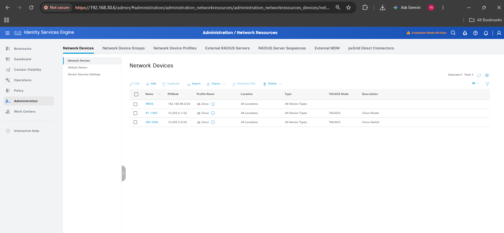
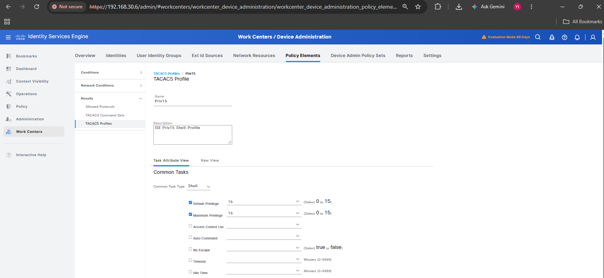
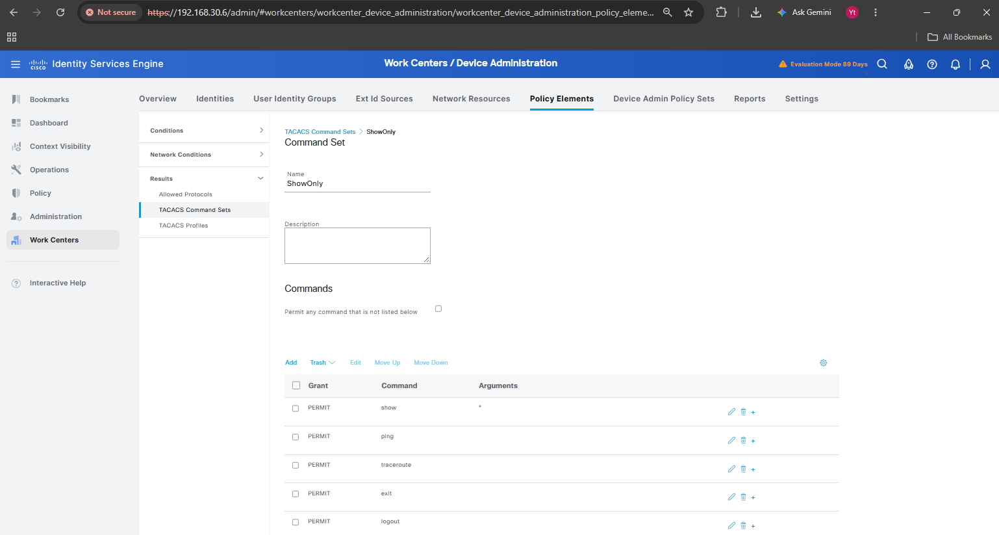
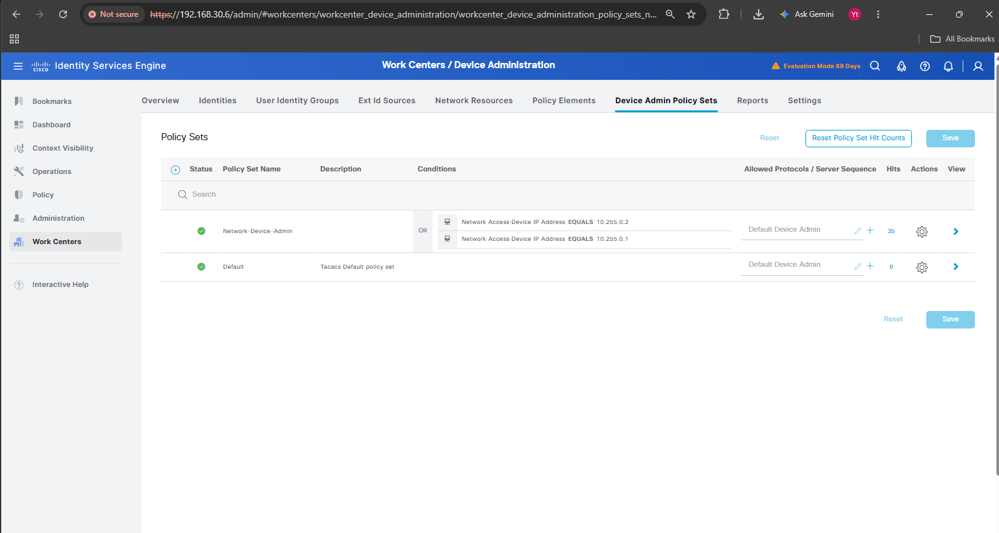
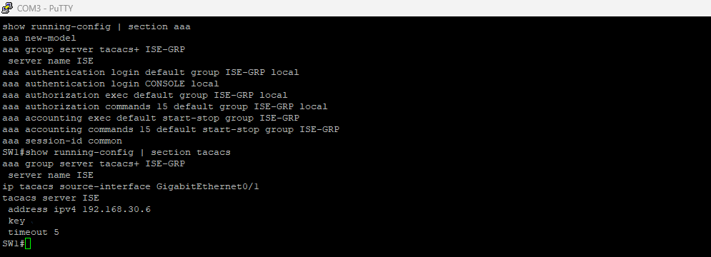
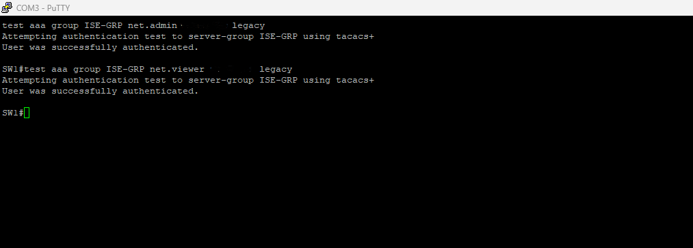
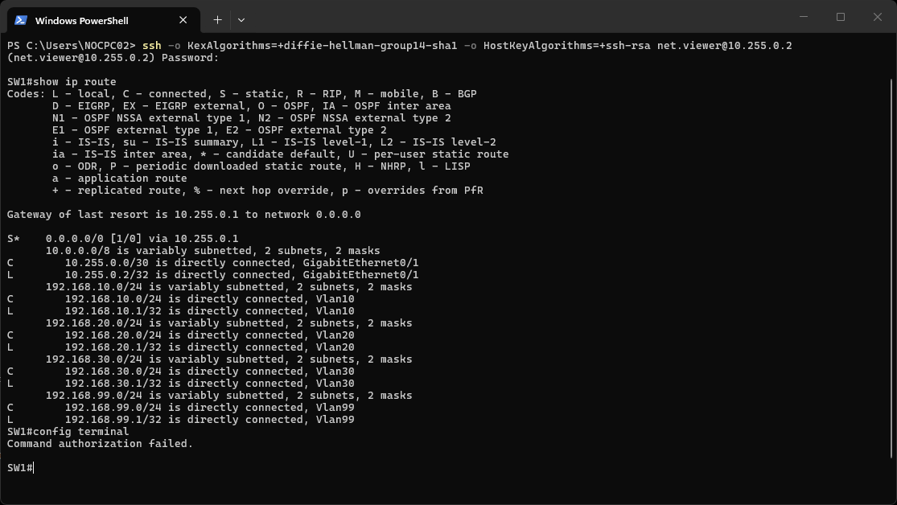
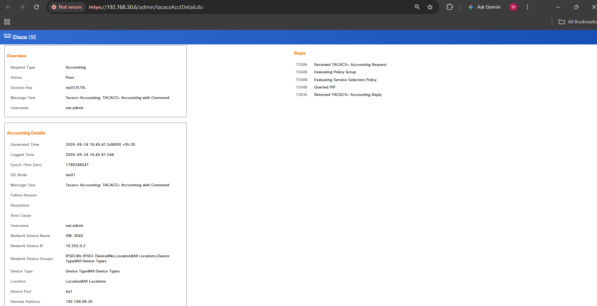
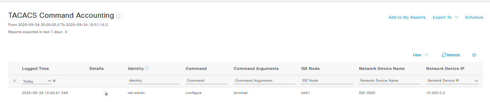

# Cisco ISE TACACS+ Device Administration Lab

A hands-on lab implementing **role-based device administration** for network infrastructure using **Cisco ISE (Identity Services Engine)** and **TACACS+**, so that switch/router admin access is centrally authenticated, authorized per command, and fully accounted for — instead of relying on shared local passwords.

---

## 📌 Project Objective

Move CLI login for network devices away from local usernames/passwords to a centralized **TACACS+** server on Cisco ISE, enforce **role-based command authorization** (full admin vs. read-only), and prove the model works with live authentication, authorization, and command-accounting logs — including a deliberate failure test.

---

## 🖧 Environment Overview

| Component | Details |
|---|---|
| AAA Server | Cisco ISE — Device Administration Work Center (TACACS+) |
| Network Device | Cisco Catalyst switch (SW1), AAA + TACACS+ client configured |
| Admin user | `net.admin` — member of `NetAdmins` group — full CLI access (Priv 15, all commands) |
| Read-only user | `net.viewer` — member of `NetReadOnly` group — show commands only, config commands denied |

---

## ⚙️ Step 1 — Enable Device Administration on ISE

Enabled the TACACS+ Device Administration service on Cisco ISE and confirmed the application services were running before building any policy.

---

## ⚙️ Step 2 — Identities and Network Devices

Created two identity groups (`NetAdmins`, `NetReadOnly`) with matching internal user accounts, and registered the Catalyst switch as a AAA client in ISE.

---

## ⚙️ Step 3 — Shell Profiles and Command Sets (Policy Elements)

Built the building blocks of role-based access: a shell profile granting Privilege 15, and two command sets — one permitting everything, one permitting only `show` commands.

---

## ⚙️ Step 4 — Device Admin Policy Set

Created a Device Administration policy set scoped to the network device's IP, with an authentication policy and three authorization rules mapping identity group → command set + shell profile.

| Rule | Identity Group | Command Set | Shell Profile |
|---|---|---|---|
| Admin | `NetAdmins` | PermitAll | Priv15 |
| ReadOnly | `NetReadOnly` | ShowOnly | Priv15 |
| Default | — | DenyAllCommands | Deny All Shell Profile |

---

## ⚙️ Step 5 — Catalyst Switch AAA/TACACS+ Configuration

Configured the switch to point at the ISE server for AAA, set the TACACS+ source interface, secured VTY lines behind TACACS+ authentication, and confirmed a test login worked.

---

## ✅ Step 6 — Verification: Role-Based Command Authorization

### Read-only user: `show` allowed, `configure` denied
Logged in as `net.viewer` over SSH — `show ip route` succeeded, but `configure terminal` was correctly blocked with **"Command authorization failed."**

### ISE-side confirmation for both roles
Cross-checked in ISE that `net.admin` was authorized for full command access and `net.viewer` authenticated successfully but was correctly restricted.

### Live logs and command accounting
Reviewed ISE's live authentication logs showing both roles' results side by side, then confirmed **command accounting** was logging every command run on the device — full traceability of who ran what.

### Negative test — wrong password
Deliberately tested a login with an incorrect password to confirm ISE correctly rejects invalid credentials and logs the failure with full protocol detail.

---

## ✅ Results

- Centralized network device admin authentication on **Cisco ISE** using **TACACS+**, replacing local device credentials.
- Implemented **role-based command authorization**: full admin access for `NetAdmins`, `show`-only access for `NetReadOnly`, with `configure terminal` explicitly blocked for read-only users.
- Verified enforcement live on the switch (`Command authorization failed.`) and cross-confirmed the same result in ISE's live logs.
- Confirmed **command accounting** logs every command executed per user for full audit traceability.
- Validated failure handling with a deliberate wrong-password test, confirming ISE correctly rejects and logs invalid login attempts.

---

## 🛠️ Skills Demonstrated

`Cisco ISE` `TACACS+` `AAA (Authentication, Authorization, Accounting)` `Role-Based Access Control` `Device Administration` `Cisco Catalyst Switch Configuration` `Command Authorization` `Security Auditing / Logging` `Network Troubleshooting`
